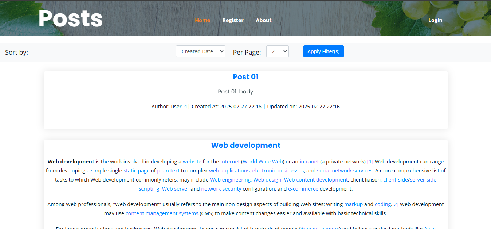
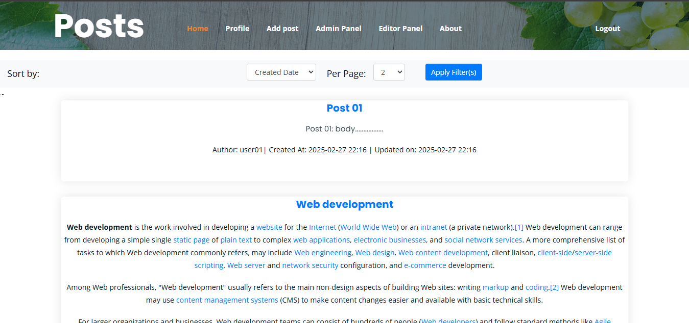
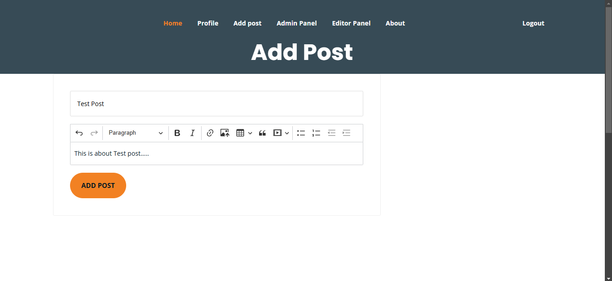
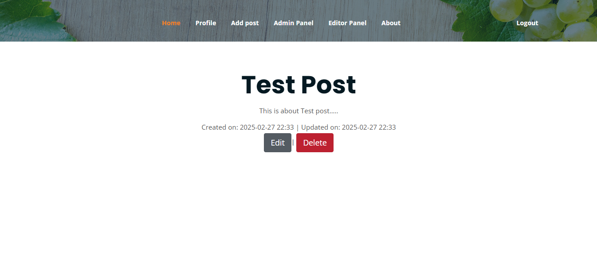
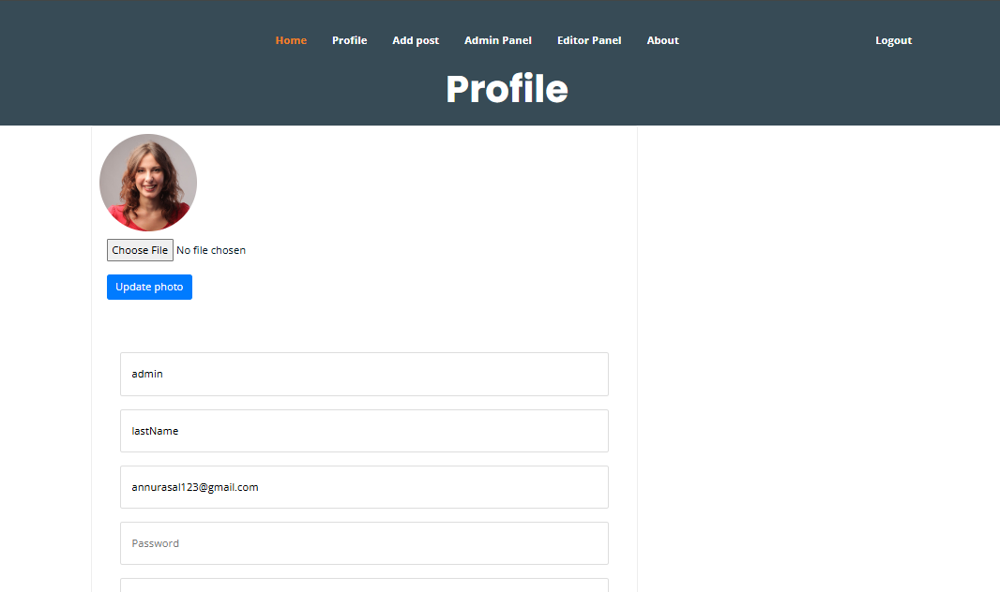
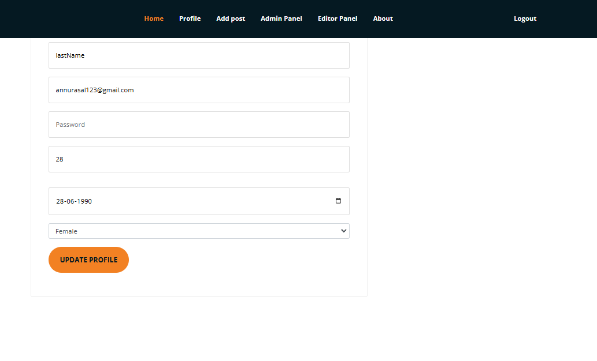
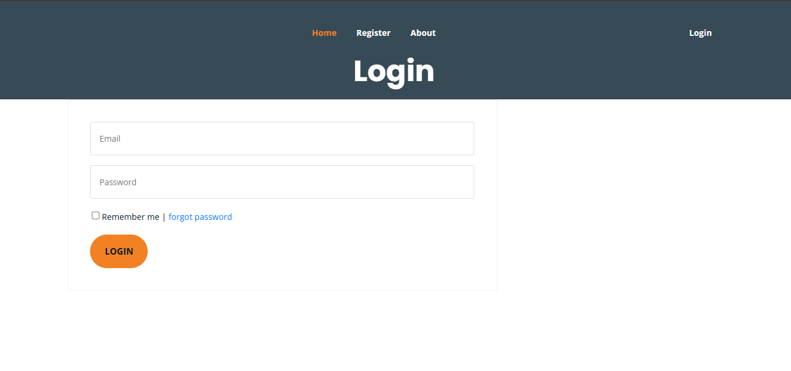
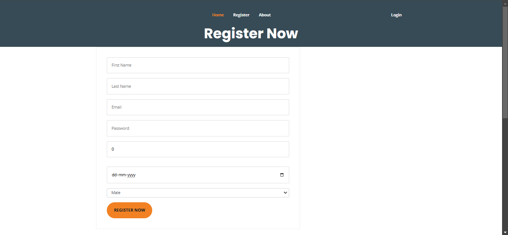
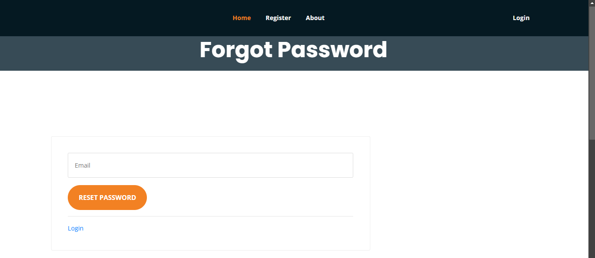
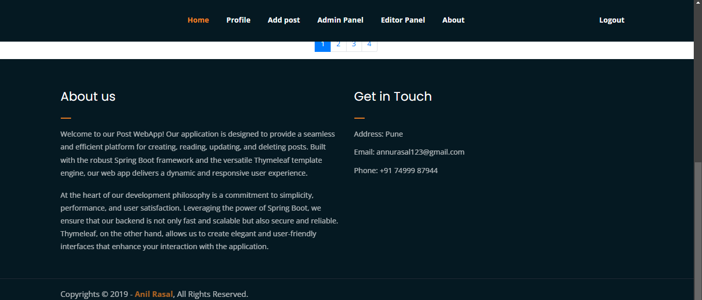

# Post Web App

Welcome to the Post Web App, a dynamic web application that allows users to create, view, edit, and delete posts. This project is built with Java Spring Boot, Thymeleaf, and Spring Security, featuring role-based authentication and authorization.

## Features

- **User Registration:** Users can register an account with a valid email address.
- **Email Verification:** A token is sent to the user's email address as a link for verification. Once the link is clicked, the user's account is activated.
- **Password Reset:** Users can request a password reset link, which is sent to their email address. Clicking the link allows them to change their password.
- **Post Management:** Users can create, edit, view, and delete their own posts. All users can view posts created by others.
- **Profile Management:** Users can edit and view their profile, including updating their profile picture.
- **Password Change:** Users can change their password after logging in.
- **Role-Based Access:** Only users with admin or editor roles have access to the admin panel. Admins can manage users and their posts.

## Technologies Used

- **Java Spring Boot:** Backend framework for building and running the application.
- **Thymeleaf:** Template engine for rendering dynamic web pages.
- **Spring Security:** Framework for handling authentication and authorization.
- **H2 Database:** An in-memory database used for development and testing. However, the application can be configured to use other databases like MySQL, PostgreSQL, etc.
- **Spring Data JPA:** Data access layer for interacting with the database.
- **Maven:** Build and dependency management tool.

## Installation

1. **Clone the repository:**
   ```bash
   git clone https://github.com/anilrasal/posts-app-with-spring-boot-thymeleaf.git
   cd post-webapp
   ```
2. **Configure the database:**

   By default, the application uses the H2 database. If you want to use another database (e.g., MySQL), update the application. properties file with the appropriate database credentials.

3. **Build and run the application:**

```bash
mvn clean install
mvn spring-boot:run
```

4. **Access the application:** Open your browser and navigate to http://localhost:8080.

## Usage

## User Registration

1. Navigate to the registration page.

2. Fill in the required details and submit the form.

## Password Reset

1. Navigate to the forgot password page.

2. Enter your email address and submit the form.

3. Check your email for a password reset link.

4. Click the link to change your password.

## Post Management

1. Log in to your account.

2. Navigate to the posts section.

3. Create a new post, edit existing posts, or delete your own posts.

4. View posts created by other users.

## Profile Management

1. Log in to your account.

2. Navigate to your profile page.

3. Edit your profile information or update your profile picture.

4. Change your password if needed.

## Admin Panel

1. Log in with an admin or editor account.

2. Navigate to the admin panel.

3. Manage users and their posts.

## Snippets of project




















